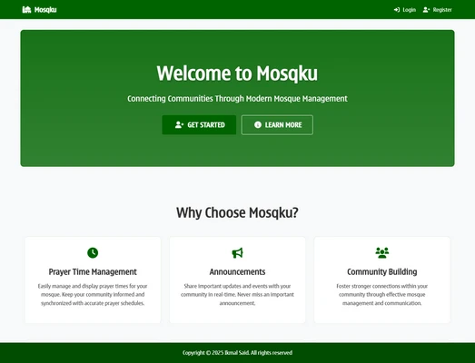

# Mosqku - Mosque Management System

A modern web application for managing multiple mosques (#GodamSahur 2025)



## ✨ Key Features

- 🕌 **Multi-mosque Support**
  - Manage multiple mosques from one platform
  - Detailed mosque information management
  - Capacity and contact tracking
- 🕒 **Prayer Time Management**
  - Schedule and update prayer times
  - Daily prayer time display
  - Automatic scheduling
- 📢 **Announcement System**
  - Create and manage announcements
  - Set announcement duration
  - Target specific audiences
- 👥 **Role-based Access Control**
  - Superadmin: Full system access and mosque management
  - Admin: Mosque-specific management and ability to add co-administrators
  - Staff: Limited mosque management capabilities
  - Visitors: View mosque information
- 🔐 **Account Security**
  - Recovery key system for password reset
  - Secure password requirements
  - View recovery key functionality
  - Password reset with recovery key
- 📦 **Inventory Management**
  - Track mosque assets and equipment
  - Manage maintenance schedules
  - Record item conditions and locations
  - Import/Export inventory data (CSV)
  - Bulk data management support
- 💰 **Financial Management**
  - Track donations and expenses
  - Generate financial reports
  - Manage mosque budgets
  - Import/Export financial data (CSV)
  - Bulk transaction management

## 🚀 Quick Start

### Local Development

1. Clone and enter the repository:
```bash
git clone https://github.com/ikmalsaid/mosqku.git
cd mosqku
```

2. Set up Python environment:
```bash
python -m venv venv

# Windows
venv\Scripts\activate

# Unix/MacOS
source venv/bin/activate
```

3. Install and initialize:
```bash
pip install -r requirements.txt
python app.py
```

4. Access the application:
- Open `http://localhost:7860`
- Login with default superadmin account:
  ```
  Email: admin@mosqku.com
  Password: Admin@123
  ```
- Or create a new account

### ⚠️ Important Notes
- For security reasons, please change the default superadmin password after your first login!

### 🛠️ Server Configuration
The `app.py` script uses `start_server()` which accepts several parameters to customize the server:

- `demo_mode` (default: False)
  - When True, starts the application with a pre-defined demo database
  - Useful for testing and demonstration purposes
  
- `custom_error_handler` (default: True)
  - Enables custom error pages and responses
  - Recommended to keep enabled for better user experience
  
- `launch` (default: True)
  - Automatically launches the web server
  - Set to False if you want to start the server manually
  
- `host` (default: '0.0.0.0')
  - The host address to bind the server to
  - Use '127.0.0.1' for local-only access
  - Use '0.0.0.0' to allow external access
  
- `port` (default: 7860)
  - The port number for the web server
  - Can be changed if 7860 is already in use

- `debug` (default: False)
  - Enables Flask server debug mode.
  - Useful for debugging purposes.

Example with custom configuration:

```python
from main import start_server
start_server(
    demo_mode=True,
    host='0.0.0.0',
    port=5678,
    launch=True,
    custom_error_handler=True,
    debug=False
)
```

## 👥 User Roles & Capabilities

### Superadmin
- Manage all mosques in the system
- Create and edit mosque administrators
- Full system configuration access
- Assign administrators to any mosque
- Import/Export data across all mosques

### Admin
- Manage assigned mosque details
- Control prayer times and announcements
- Add co-administrators to their mosque
- Manage mosque inventory and finance
- View and manage mosque-specific administrators
- Import/Export mosque-specific data

### Staff
- Manage assigned mosque details
- Control prayer times
- Manage announcements

### Visitors
- View mosque information
- Access prayer times
- Read announcements

## 🏗️ Project Structure
```
mosqku/
├── main/
│   ├── static/          # Assets (CSS, JS, Favicon)
│   ├── models/          # Database models
│   ├── controllers/     # Route handlers
│   ├── templates/       # HTML templates
│   └── __init__.py      # Main server file
├── instance/            # Database instance
├── requirements.txt     # Dependencies
└── app.py               # Launcher file
```

## 🛠️ Technical Stack

### Backend
- **Framework**: Flask (Python)
- **Database**: SQLite with SQLAlchemy ORM
- **Authentication**: Flask-Login
- **Form Handling**: Flask-WTF with CSRF protection

### Frontend
- **Framework**: Server-side rendered templates with Jinja2
- **UI Framework**: Bootstrap
- **Icons**: Font Awesome
- **JavaScript**: Vanilla JS with Bootstrap's bundle
- **Custom Styling**: CSS with custom font

### Features
- Server-side rendering for better SEO and initial load performance
- Responsive design for all device sizes
- Interactive UI components with Bootstrap
- Custom animations and transitions
- AJAX for dynamic data loading
- Form validation on both client and server side

## 🔒 Security Features

- Scrypt password hashing
- Role-based access control
- Form validation with CSRF protection
- Secure session management
- Recovery key system for password reset
- Secure password requirements enforcement
- Secure file upload validation
- Data import validation and sanitization

## 📄 License

See [LICENSE](LICENSE) for details.